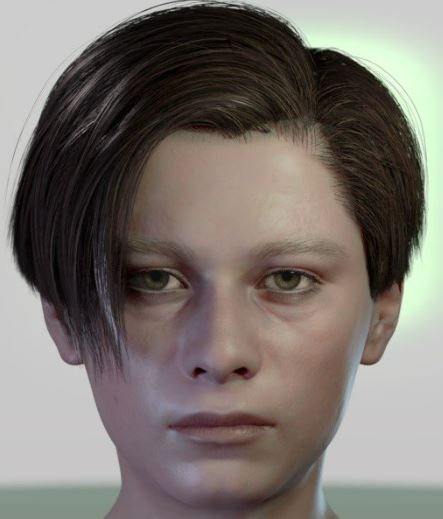
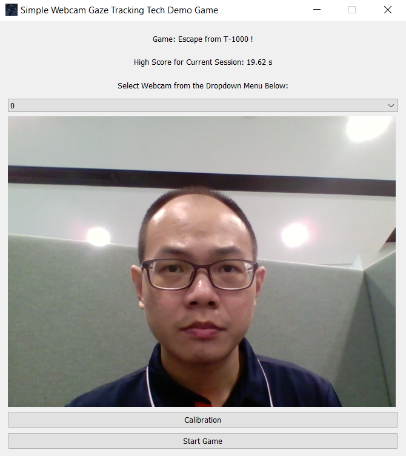
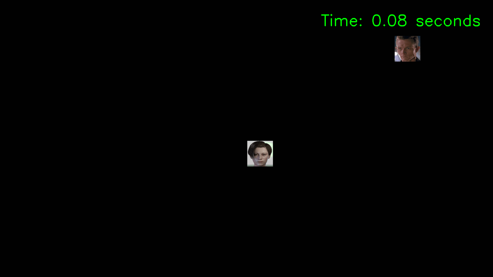

# Webcam_Gaze_Tracking_Demo

This repository contains a simple python-based game which demonstrates the Proof-of-Concept (POC) webcam gaze tracking technology that is intended to be used in a web-based eye monitoring software for users who are suffering from Age-Related Macular Degeneration (AMD).

## Instructions:

In this game, your task is to play the role of the legendary John Connor, and try to escape from the T-1000 that has been sent back in time to kill him, in a very simple replay of the chase scene in the movie "Terminator 2: Judgement Day". 

John Connor:

T-1000:

When the game is first executed, it will attempt to detect all the webcam(s) that is attached to the PC/laptop, after which a simple Graphics User Interface (GUI) will appear, as illustrated below:

Select the webcam which you want to use from the dropdown menu, and a preview of the webcam feed will be shown on the GUI. Once you are satisfied with your choice, you can click on the "Calibration" button, at which point the calibration process will begin. Throughout this calibration process, all you have to do is to stare at the colored circles as they appear on the screen, without moving your head. A preview of the calibration process is illustrated below. Once the calibration process is completed, you will be taken back to the GUI page, but with the "Start Game" button enabled this time.

Once you click on the "Start Game" button, the game will begin. All you have to do is to look at a particular position on the screen, and John Connor will start to move towards wherever you are looking at. Do note that John Connor will always spawn at the centre of the screen. The T-1000 will initially spawn at random locations throughout the screen (but will always be sufficently far away from John Connor so that you have time to plan an escape route), and it will always move towards John Connor's position. If the T-1000 gets too close to John Connor, then he will be "terminated", and the game ends with the current surviving time displayed on the screen. Your task is to survive for as long as possible without getting caught by the T-1000. A quick demonstration of the game play is illustrated below.

The longest surviving time for each session will then be updated and displayed on the GUI page (which is 19.62s in this case). 

## Installation:

All you have to do to play this game in your system is to follow the simple steps below:
1. Make sure that you have Python 3 (tested on Python 3.8 and above) installed in your system
2. Download and unzip this repository, and store it in a location of your choice in your system
3. Open a Command Prompt (or terminal) window and change the working directory to the location where you stored the downloaded repository
4. Run the following command in order to install all the necessary packages: `pip install -r requirements.txt` (Make sure that you have the administrative rights to install the packages)
5. Run the following command, and you are good to go: `python game.py`

## Known Issues:

1. It has been tested and confirmed that this game is unable to detect the following webcam: "ASUS ROG Eye S"
